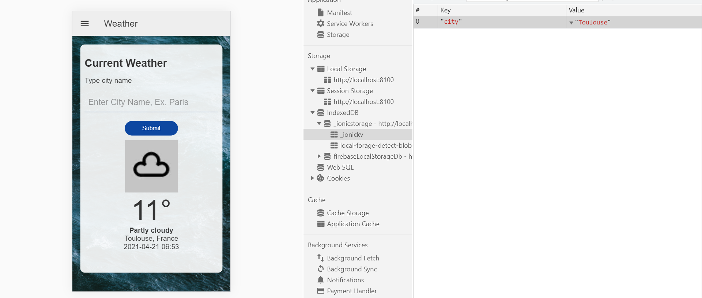

# Ionic Angular App WeatherApi

- App to display weather data from the [Weatherstack weather API](https://weatherstack.com/documentation) using the [Ionic framework](https://ionicframework.com/docs).
- Some changes were made to the code so it would work in the latest Angular version.
- **Note:** to open web links in a new window use: _ctrl+click on link_

## Table of contents

- [Ionic Angular WeatherApi](#ionic-angular-weatherapi)
  - [Table of contents](#table-of-contents)
  - [General info](#books-general-info)
  - [Screenshots](#camera-screenshots)
  - [Technologies](#signal_strength-technologies)
  - [Setup](#floppy_disk-setup)
  - [Features](#cool-features)
  - [License](#file_folder-license)
  - [Contact](#envelope-contact)

## :General info

- The [Weatherstack weather API](https://weatherstack.com/documentation) is a fully managed weather API platform that provides extensive APIs
  that supply the following data:

- Real-time weather
- Up to 14 day weather forecast
- Historical weather inforamtion
- Astronomy
- Time zone
- Geolocation data

## :Screenshots

## :Technologies

- [Ionic v6](https://ionicframework.com/)
- [Angular v15](https://angular.io/)
- [Ionic/angular v6](https://www.npmjs.com/package/@ionic/angular)
- [Ionic storage-angular v3](https://www.npmjs.com/package/@ionic/storage-angular)
- [Weatherstack weather API](https://weatherstack.com/documentation)

## :Setup

- `npm i` to install dependencies
- Get yourself an API key from [weatherstack.com](https://weatherstack.com/) and add to `weather.service.ts` line 4
- To start the server on _localhost://8100_ type: 'ionic serve'

## : Features

- Searches for weather data in any city of the world
- Ionic storage module used

## : License

- This project is licensed under the terms of the MIT license.

## : Contact

- Repo created by [sumitsarraf](https://github.com/sumitsarraf), email: sumitsarroff@gmail.com
